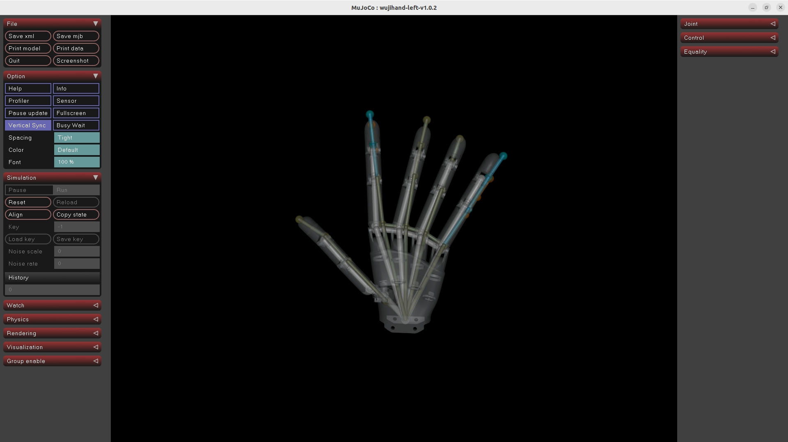
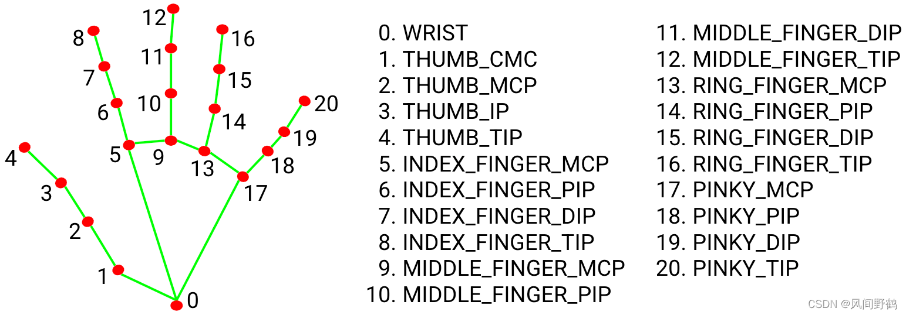

# Custom Input Device Integration Guide

> **Audience**: Customers integrating their own hand input devices (gloves, XR headsets, mocap systems, etc.) with wuji-retargeting.
>
> **Core principle**: **You only need to convert your device data into the repository's unified hand keypoint format. The retargeting / simulation / real-hardware pipeline is fully reusable — no algorithm changes are required.**
>
> **AI-assisted integration**: **Provided that your device can already output raw data in Python, this guide can be handed directly to an AI assistant (e.g., Claude, Cursor) to complete the integration step by step.**

---

## 1. The Only Requirement on the Input Layer

Every input device only needs to implement one method:

```python
def get_fingers_data(self) -> dict:
    return {
        "left_fingers":  np.ndarray,  # shape (21, 3), unit: meters
        "right_fingers": np.ndarray,  # shape (21, 3), unit: meters
    }
```

Conventions:
- When a hand is unavailable, return an all-zero array `np.zeros((21, 3))`
- The 21-point order **must match the MediaPipe hand landmark definition** (see appendix)
- Coordinates use the wrist (point 0) as the reference origin

Once this interface is aligned, all scripts including `example/teleop_sim.py` and `example/teleop_real.py` can be reused directly.

---

## 2. Identify Your Device Category

**Category A: Device already outputs 21 hand keypoints** (simplest)

Examples: Meta Quest, Apple Vision Pro. Only requires keypoint reordering, axis transformation, and unit normalization.

**Category B: Device outputs a custom skeleton** (different point count or order)

Examples: some mocap gloves. Requires mapping from the custom skeleton to MediaPipe 21-point format first.

---

## 3. Integration Steps

### Step 1: Create the input device class

Create `my_device.py` under `example/input_devices/` using this template:

```python
import numpy as np
from .base import InputDeviceBase


class MyDevice(InputDeviceBase):
    def __init__(self, ...):
        # Initialize SDK / network connection / serial port, etc.
        pass

    def get_fingers_data(self) -> dict:
        raw = self._read_raw()
        left, right = self._convert(raw)
        return {"left_fingers": left, "right_fingers": right}

    def _read_raw(self):
        # Read raw data from the device
        raise NotImplementedError

    def _convert(self, raw) -> tuple:
        """
        Convert to (21, 3), unit: meters.
        Handle: keypoint reordering, axis transformation, unit conversion, left/right hand distinction.
        """
        left  = np.zeros((21, 3), dtype=np.float32)
        right = np.zeros((21, 3), dtype=np.float32)
        # ... your conversion logic ...
        return left, right
```

Existing implementations as references:

| File | Reference scenario |
|------|--------------------|
| `example/input_devices/visionpro.py` | Live TCP streaming |
| `example/input_devices/mediapipe_replay.py` | pkl file replay |
| `example/input_devices/video_mediapipe.py` | Video stream + MediaPipe inference |

### Step 2: Register in `teleop_sim.py` and `teleop_real.py`

`teleop_sim.py` (simulation) and `teleop_real.py` (real hardware) have identical structure. **Both files must be updated consistently.**

In each file, add to the `device_map` dictionary:

```python
"my_device": lambda: MyDevice(...),
```

And add `"my_device"` to the `choices` list of the `--input` argument.

### Step 3: Prepare the YAML configuration

Copy an existing config and adjust as needed:

```bash
cp example/config/adaptive_analytical_avp.yaml \
   example/config/adaptive_analytical_my_device.yaml
```

> If using the key-vector optimizer, copy `example/config/vector/vector_avp.yaml` instead.

Parameters that typically need adjustment:

| Parameter | Description |
|-----------|-------------|
| `mediapipe_rotation` | Compensates for coordinate system differences relative to AVP |
| `segment_scaling` | Adjusts per-finger per-joint scaling for user hand size |
| `lp_alpha` | Low-pass filter strength; decrease when device is noisy (smoother but slightly more latency) |
| `norm_delta` | Controls the magnitude of joint angle changes between consecutive frames |
| `pinch_thresholds` | Pinch detection thresholds; adjust for device accuracy |

---

## 4. Debugging Order

**Strongly recommended to follow the order — do not skip stages.**

### Stage 1: Record a data sample first; do not connect a live stream directly

Whether your device is a live stream or an SDK, record data to a pkl file first before connecting to debugging scripts. This makes problems reproducible and helps quickly distinguish "data issues" from "algorithm issues".

Recording format (compatible with the repository's existing format):

```python
import pickle

frames = []
# In your data collection loop:
frames.append({
    "t": timestamp_in_seconds,       # float, seconds
    "left_fingers":  left_kp,        # np.ndarray (21, 3), unit: meters
    "right_fingers": right_kp,       # np.ndarray (21, 3), unit: meters
})

with open("example/data/my_device_sample.pkl", "wb") as f:
    pickle.dump(frames, f)
```

After saving, replay directly with `MediaPipeReplay`:

```bash
cd example
python teleop_sim.py --play data/my_device_sample.pkl --hand right \
    --config config/adaptive_analytical_my_device.yaml
```

### Stage 2: Inspect skeleton overlay with `tuning_tool.py`

```bash
cd example
python tuning_tool.py --play data/my_device_sample.pkl --hand right \
    --config config/adaptive_analytical_my_device.yaml
```

Example result:



Three-color skeleton meanings:

| Color | Meaning |
|-------|---------|
| Orange | Raw input keypoints |
| Cyan | Target after `segment_scaling` adjustment |
| White | Robot FK result (retargeting output) |

Key checks:
- Hand pose correct; left/right hand not swapped
- Palm orientation reasonable; scale within normal range
- Orange and cyan trends consistent; white follows cyan

`tuning_tool.py` supports live hot-reload of the config file. YAML changes take effect immediately on save, enabling fast parameter tuning.

> **Note**: `tuning_tool.py` only supports tuning via pkl replay (`--play`) or existing video/camera shortcuts (`--video` / `--realsense` / `--zed`). **Custom live devices are not directly supported.** To tune with MyDevice in realtime, first record a pkl per Stage 1 and then replay for tuning, or extend `tuning_tool.py` with a corresponding shortcut yourself.

### Stage 3: Run MuJoCo simulation with `teleop_sim.py`

```bash
python teleop_sim.py --play data/my_device_sample.pkl --hand right \
    --config config/adaptive_analytical_my_device.yaml
```

Verify that motion is smooth across frames, has no obvious jitter, and does not break down at extreme poses.

### Stage 4: Connect the live stream and real hardware last

After simulation verification passes, connect the live device:

```bash
# Simulation
python teleop_sim.py --input my_device --hand right \
    --config config/adaptive_analytical_my_device.yaml

# Real hardware
python teleop_real.py --input my_device --hand right \
    --config config/adaptive_analytical_my_device.yaml
```

---

## 5. Troubleshooting

| Symptom | Cause | Diagnostic direction |
|---------|-------|----------------------|
| Moving the right hand makes the robot mirror as the left hand | Left/right hands swapped | Check `left_fingers`/`right_fingers` assignment; check the `--hand` argument |
| Palm orientation or bend direction abnormal | Wrong axes | Swap axes or negate signs in `_convert()`; or compensate with `mediapipe_rotation` |
| Hand looks too small or too large | Wrong unit | Divide mm by 1000 to convert to meters |
| A particular finger consistently mismapped | Wrong keypoint order | Verify against the 21-point mapping table in the appendix |
| Severe jitter in simulation | High device noise | Decrease `lp_alpha`; or increase `norm_delta` |

---

## 6. Appendix: MediaPipe 21-Point Order

```text
Index   Joint name
 0      Wrist (coordinate origin)
 1      Thumb CMC      2    Thumb MCP      3    Thumb IP      4    Thumb TIP
 5      Index MCP      6    Index PIP      7    Index DIP     8    Index TIP
 9      Middle MCP    10    Middle PIP    11    Middle DIP   12    Middle TIP
13      Ring MCP      14    Ring PIP      15    Ring DIP     16    Ring TIP
17      Pinky MCP     18    Pinky PIP     19    Pinky DIP    20    Pinky TIP
```



If your device has a different skeleton order, reorder in `_convert()`:

```python
# Fill in the actual device order; values are device-native indices
DEVICE_TO_MEDIAPIPE = [0, 4, 3, 2, 1, 8, 7, 6, 5, ...]
kp_mediapipe = kp_device[DEVICE_TO_MEDIAPIPE]
```
